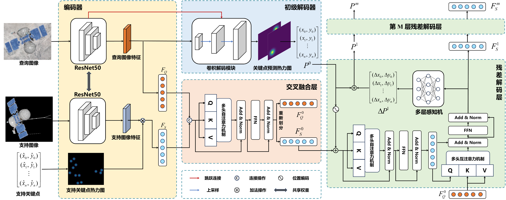

# CSKDet

This is the repository for the **Paper:** [Cross-category Spacecraft Keypoints Detection Method with Visual Feature Prompts](https://www.aas.net.cn/cn/article/doi/10.16383/j.aas.c250472?viewType=HTML), published in **Acta Automatica Sinica (自动化学报)**.

  

## Summary
CSKDet is a cross-category spacecraft keypoint detection method based on visual feature prompts. Unlike conventional spacecraft keypoint detection methods that are trained for a specific spacecraft category, CSKDet can generalize to previously unseen spacecraft categories using only one support image with corresponding keypoint annotations. Given a support image and a query image, the model predicts the keypoint positions of the target spacecraft in the query image.

To evaluate the proposed method, we constructed a Spacecraft Pose Estimation (SPE) dataset using a virtual simulation platform, covering multiple types of spacecraft with 2D keypoint and 3D pose annotations. Extensive experiments demonstrate the effectiveness of CSKDet for cross-category spacecraft keypoint detection and its potential for high-precision pose estimation when combined with conventional PnP algorithms.

The source code of CSKDet is open-sourced in this repository.

## Getting Started
### Conda Environment
We train and evaluate our model on Python 3.10 and Pytorch 2.3.1 with CUDA 11.8.

### SKD Dataset

Please prepare the SPE dataset for training and evaluation.

You can download the SPE dataset [HERE](https://pan.baidu.com/s/1hErUk3jyHgYkgf6LokzBXw?pwd=krm9).
